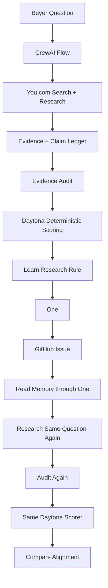

# Kojable — Self-Improving Answer Alignment Agent

## AI answers are becoming part of the buying journey

Buyers increasingly use generative AI to research vendors, compare products, and shape purchase decisions.

That creates a new commercial risk: if an AI answer is outdated, weakly evidenced, incomplete, or misleading, a company can lose consideration before a buyer reaches its website or speaks to sales.

> **Why this matters:** In Gartner's survey of 645 B2B buyers conducted from August through September 2025, **45% said they used GenAI during a recent purchase, primarily to gather information on vendors and products**. At the same time, **51% said they were more likely to encounter misleading information from GenAI**.
>
> — [Gartner, May 20, 2026](https://www.gartner.com/en/newsroom/press-releases/2026-05-20-gartner-survey-finds-sixty-nine-percent-of-b-two-b-buyers-turn-to-sales-reps-to-validate-ai-generated-insights)

When AI is helping form vendor perceptions, answer quality becomes a commercial issue—not just a model-quality issue.

```text
Weak AI answer
      ↓
Wrong or incomplete vendor perception
      ↓
Buyer consideration can change
      ↓
Commercial risk
```

## What Kojable does

**Kojable closes that loop.**

Most AI agents search, generate an answer, and stop. Kojable measures the evidence behind its own answer, identifies where the research is weak, learns a better research rule, persists that learning to a real external system, retrieves it, retries the exact same question, and measures whether the new answer is actually better.

## Verified live result

We tested the loop with one buyer-style comparison:

> **Which is better for AI agent web search, You.com or Exa?**

| | Run 1 | Run 2 |
|---|---:|---:|
| Answer Alignment | **63%** | **90%** |
| Evidence weaknesses | **8** | **1** |

**+27 percentage points in Answer Alignment**

The buyer question did not change. The second run changed only after the agent audited Run 1, learned a research rule, persisted that learning externally through One and GitHub, read it back, and applied it to the next research attempt.

This is an observed result, not a guaranteed outcome. Individual runs can improve, remain unchanged, or regress because live web research is stochastic. See the [verified result](docs/DEMO_RESULT.md) and [sanitized example](examples/demo_result.json).

The goal is not to make You.com win the comparison. The goal is to make the answer better aligned with current evidence.

For a company, the same loop could be applied to questions buyers ask about its product, competitors, capabilities, pricing, risks, or category—identifying where AI representation is weak and testing whether an intervention improves it.

## How the agent learns

Kojable was built for the **Self-Improving and Learning Agents** hackathon challenge.

```text
Research → Audit evidence → Measure alignment
 → Learn from the highest-impact failure
 → Persist learning to GitHub through One
 → Read learning back → Retry the exact same question → Measure again
```

The agent learns **how to research better**. It does not learn **which vendor to prefer**. It selects one reusable research method from the highest-impact evidence failure observed in Run 1.

## Architecture



## Partner stack

| Partner | Real role |
|---|---|
| You.com | Live search, query-aware evidence, structured research and audit |
| CrewAI | Orchestrates the complete improvement Flow |
| Daytona | Executes deterministic scoring in isolated sandboxes |
| One | Discovers documented GitHub actions, writes learning, and reads it back |
| Clean Data | Checks provenance and supporting evidence for material claims |

## Clean Data

Evidence retains source URL, publisher/domain, retrieval time, supporting passage, publication/update date where available, and source type. The provenance gate reports valid, incomplete, or invalid. Dates are never fabricated; missing dates remain incomplete. Conflicting evidence is not silently removed. Research targets public product/company evidence and does not collect personal data.

## The agent changes a real system

One persists the learned rule to a real GitHub Issue and reads it back. Run 2's research instructions must use the retrieved rule. Local learning traces do not substitute for that round trip.

Live memory: [GitHub Issue #1](https://github.com/piushvaish/you-hackathon/issues/1).

Failure → Learning → External state change → Persistent memory → Retrieval → Changed behavior.

The issue demonstrates memory, not the authoritative demo score. The reused issue may contain an older baseline. The completed comparison artifact supplies scores.

## Demo

Full live loop:

```powershell
python -m kojable_agent --loop
```

Clean result summary:

```powershell
python -m kojable_agent --summary
```

Summary reads the current comparison and optional audit files offline, without credentials or artifact changes. Missing audit counts show unavailable. It never substitutes the canonical example for current results.

### Video

YouTube demo: [ADD YOUTUBE URL]

See the [90-second script](docs/VIDEO_SCRIPT.md).

## Setup

Use Python 3.11–3.13 (3.12 recommended), Node.js with working npm, and You.com, Daytona, and One accounts. From the repository root:

```powershell
py -3.12 -m venv .venv
.\.venv\Scripts\Activate.ps1
python -m pip install --upgrade pip
python -m pip install -e ".[dev]"
```

Copy `.env.example` to `.env` only if it does not already exist. Populate `YDC_API_KEY` and `DAYTONA_API_KEY` manually. `ONE_SECRET` is optional when the CLI manages authentication. Never commit `.env`.

```powershell
npm install -g @withone/cli
one init
one add github
one --agent connection list
```

Complete browser authentication and grant GitHub issue access. Interactive setup is manual. Windows One subprocesses use UTF-8 and the system certificate store.

## Run

```powershell
python -m kojable_agent --preflight
python -m kojable_agent --baseline
python -m kojable_agent --loop
python -m kojable_agent --summary
```

No flag runs the original baseline. Preflight checks local configuration, SDK availability, One authentication, and inferred GitHub write access; it does not prove every live You.com/Daytona operation will succeed. A live loop intentionally creates and retains a GitHub learning issue. Pending references are reused after retrieval failure. Live calls require credentials and may incur provider costs.

## How alignment is measured

Answer Alignment is a deterministic evidence-alignment measure for this prototype, not a universal factual-accuracy benchmark.

Each material claim earns:

- +1 when supporting evidence exists;
- +1 when supporting evidence passes Clean Data provenance;
- +1 when the auditor verdict is verified.

Both runs use the exact same algorithm in Daytona. You.com supplies audit verdicts; code calculates the score. Weak, conflicted, and unsupported claims do not earn the verification point. Weakness counts count non-verified audited claims. Improved, unchanged, and regressed outcomes are reported honestly.

## Repository structure

- `src/kojable_agent/`: research, audit, learning, Flow, scoring, and summary.
- `tests/`: offline regression tests.
- `examples/demo_result.json`: sanitized canonical result.
- `docs/`: demo result, video script, submission checklist.
- `SUBMISSION.md`: exact 200-word submission description.
- `data/`: ignored runtime artifacts: `run_1.json`, `audit_1.json`, `learning.json`, `run_2.json`, `audit_2.json`, and `comparison.json`.

```powershell
python -m pytest
python -m compileall src
```

## Hackathon submission

Challenge: Self-Improving and Learning Agents. See [submission copy](SUBMISSION.md) and [checklist](docs/SUBMISSION_CHECKLIST.md). Record a 1–3 minute video, replace both YouTube placeholders, and submit the public repository and video.
